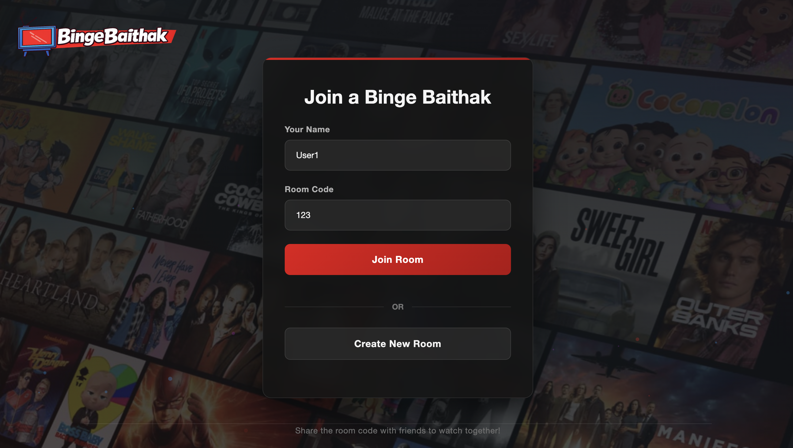
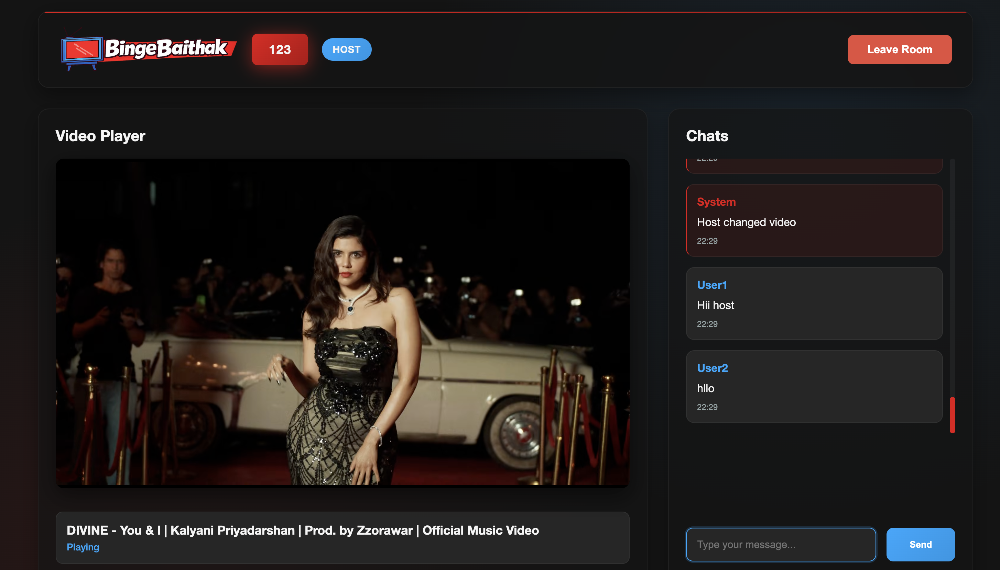
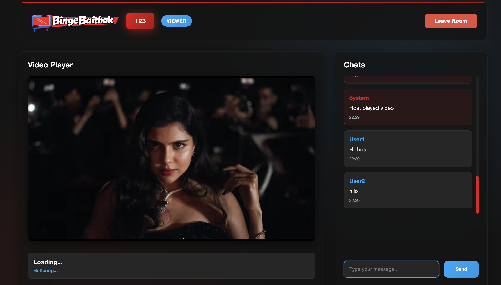
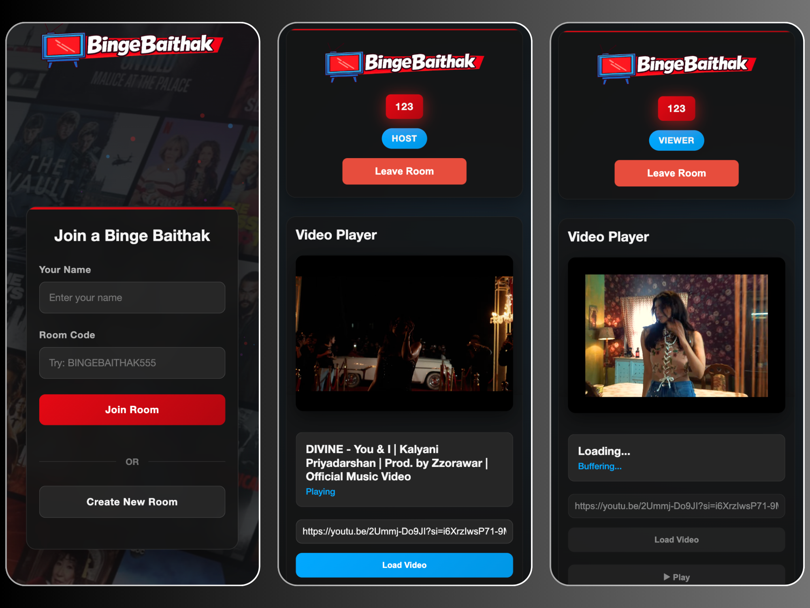

# Binge Baithak

**Real-time watch-party platform to stream movies together, stay in sync, and chat with friends — your virtual movie night, perfected.**

Watch movies with friends from different places in real-time! Create a room, share the link, and enjoy synchronized video playback with live chat — all in your browser.

---

## Live Demo
 
• **Demo Video:** Coming soon!

---

## Features

• **Real-Time Video Synchronization** – Watch together with frame-accurate sync using WebSocket-based timing  
• **Group Watch Rooms** – Create public or private rooms and invite friends with a unique room code  
• **Live Chat** – Text with friends while watching, with message history   
• **Room Management** – Easy room creation, joining, and moderation (play/pause controls for hosts)  
• **Responsive UI** – Works seamlessly on desktop, tablet, and mobile  
• **Low-Latency Streaming** – Adaptive sync logic to handle network variations and keep everyone in sync

---

## Tech Stack

| Layer         | Technology |
|---------------|------------|
| **Frontend**  | HTML5, CSS3, JavaScript |
| **Backend**   | Node.js, Express.js |
| **Database**  | MongoDB, Mongoose ODM |
| **Real-Time** | Socket.IO (WebSockets) |

---

## System Architecture

```
┌─────────────┐         ┌─────────────┐         ┌─────────────┐
│   Client    │◄───────►│   Express   │◄───────►│   MongoDB   │
│  (Browser)  │         │   Server    │         │  Database   │
└─────────────┘         └─────────────┘         └─────────────┘
       ▲                       ▲
       │                       │
       └───────────────────────┘
          Socket.IO (WebSockets)
            Real-time Sync
```

**Architecture Components:**

1. **Frontend (Client)** – Serves the UI, handles media playback, and manages user interactions
2. **Backend (Express Server)** – Room management, and database operations
3. **Socket.IO Server** – Handles real-time events: video play/pause, seek, chat messages, and user join/leave
4. **Database (MongoDB)** – Stores user profiles, room details, and chat history

---

## 📁 Project Structure

```
BINGE_BAITHAK/
├── client/                      # Frontend files
│   ├── images/                  # Static images
│   │   ├── background.jpg       # Landing page background
│   │   └── logo.png            # App logo
│   ├── js/                      # Frontend JavaScript
│   │   ├── main.js             # Homepage logic
│   │   ├── room.js             # Watch room logic
│   │   └── socket.js           # Socket.IO client setup
│   ├── index.html              # Landing/Login page
│   └── room.html               # Watch room page
│
├── server/                      # Backend files
│   ├── config/                  # Configuration files
│   │   └── db.js               # MongoDB connection
│   ├── controllers/             # Business logic
│   │   └── roomController.js   # Room CRUD operations
│   ├── models/                  # Database schemas
│   │   ├── Room.js             # Room model
│   │   └── User.js             # User model
│   ├── routes/                  # API routes
│   │   └── roomRoutes.js       # Room endpoints
│   ├── .env                     # Environment variables (create this)
│   ├── package.json            # Backend dependencies
│   ├── server.js               # Express app entry point
│   └── socket.js               # Socket.IO server logic
│
├── .gitignore                   # Git ignore file
└── README.md                    # You are here!
```

---

## Installation & Setup (Local Development)

### Prerequisites

Before you begin, ensure you have the following installed:

• **Node.js** (v18 or higher) - [Download here](https://nodejs.org/)  
• **MongoDB** - Choose one option:
  - Local installation - [Download here](https://www.mongodb.com/try/download/community)
  - MongoDB Atlas (Cloud) - [Sign up here](https://www.mongodb.com/cloud/atlas/register)  
• **Git** - [Download here](https://git-scm.com/)

---

## Step-by-Step Setup Guide

### Step 1: Clone the Repository

Open your terminal/command prompt and run:

```bash
git clone https://github.com/yourusername/binge-baithak.git
cd BINGE_BAITHAK
```

### Step 2: Set Up MongoDB

**Option A: Using Local MongoDB**

1. Start MongoDB service:
   - **Windows:** MongoDB should start automatically, or run `mongod` in command prompt
   - **Mac:** `brew services start mongodb-community`
   - **Linux:** `sudo systemctl start mongod`

2. Your MongoDB URI will be: `MONGODB_URI=your_mongodb_uri_here`

**Option B: Using MongoDB Atlas (Cloud)**

1. Go to [MongoDB Atlas](https://www.mongodb.com/cloud/atlas/register)
2. Create a free account and set up a cluster
3. Click "Connect" → "Connect your application"
4. Copy the connection string (format: `MONGODB_URI=your_mongodb_uri_here`)
5. Replace `<password>` with your database password

### Step 3: Configure Environment Variables

1. Navigate to the server folder:
   ```bash
   cd server
   ```

2. Create a `.env` file in the `server` folder:
   ```bash
   # On Windows
   copy NUL .env
   
   # On Mac/Linux
   touch .env
   ```

3. Open the `.env` file and add the following configuration:

   ```env
   PORT=3000
   MONGODB_URI=mongodb://localhost:27017/binge_baithak
   NODE_ENV=development
   ```

   **Important Notes:**
   • If using MongoDB Atlas, replace `MONGO_URI` with your Atlas connection string

### Step 4: Install Backend Dependencies

While in the `server` folder, run:

```bash
npm install
```

This will install all required packages:
• express
• mongoose
• socket.io
• jsonwebtoken
• cors
• dotenv

### Step 5: Start the Backend Server

Still in the `server` folder, run:

```bash
npm run dev
```

You should see output similar to:
```
Server running on port 3000
MongoDB connected successfully!
Socket.IO server running
```

**The backend is now running at `http://localhost:3000`**

### Step 6: Open the Frontend

1. Open a **new terminal/command prompt** window
2. Navigate to the client folder:
   ```bash
   cd BINGE_BAITHAK/client
   ```

3. Open the frontend (choose one method):

   **Option A: Using Live Server (Recommended)**
   • Install the "Live Server" extension in VS Code
   • Right-click on `index.html` → "Open with Live Server"
   • Frontend opens at `http://localhost:5500` or similar

   **Option B: Using Python**
   ```bash
   # Python 3
   python -m http.server 3000
   
   # Python 2
   python -m SimpleHTTPServer 3000
   ```
   • Frontend opens at `http://localhost:3000`

   **Option C: Direct File**
   • Simply double-click `index.html` to open in your browser
   • Note: Some features might not work due to CORS restrictions

### Step 7: Test the Application

1. Open your browser and go to `http://localhost:3000` (or your Live Server URL)
2. Create an account or log in
3. Create a new watch room
4. Share the room link with friends (or open in a new incognito window to test)
5. Load a video URL and start watching together!

---

## Important File Locations

### Where to Place What

| File/Folder | Location | Purpose |
|------------|----------|---------|
| `background.jpg` | `/client/images/` | Landing page background image |
| `logo.png` | `/client/images/` | Application logo |
| `.env` | `/server/` | Environment variables (MongoDB URI) |
| `main.js` | `/client/js/` | Frontend logic for homepage |
| `room.js` | `/client/js/` | Frontend logic for watch room |
| `socket.js` | `/client/js/` | Socket.IO client connection |
| `server.js` | `/server/` | Backend entry point |

### Key Files to Configure

1. **`/server/.env`** - Database 
2. **`/client/js/socket.js`** - Update the socket URL if deploying:
   ```javascript
   const socket = io('http://localhost:3000'); // Change to your deployed URL
   ```

---

## Deployment Guide

### Deploying Backend to Render

**Step 1: Push your code to GitHub**
```bash
git add .
git commit -m "Ready for deployment"
git push origin main
```

**Step 2: Deploy on Render**
• Go to [Render.com](https://render.com) and sign up
• Click "New +" → "Web Service"
• Connect your GitHub repository
• Configure settings:
  - **Name:** `binge-baithak-backend`
  - **Build Command:** `npm install`
  - **Start Command:** `node server.js`
  - **Instance Type:** Free

**Step 3: Add Environment Variables in Render**
• Go to "Environment" tab
• Add the following variables:
  - `MONGO_URI` = Your MongoDB Atlas connection string
  - `JWT_SECRET` = Your secret key
  - `NODE_ENV` = `production`
  - `PORT` = `10000` (Render default)

**Step 4: Deploy**
• Click "Create Web Service"
• Copy your Render URL (e.g., `https://binge-baithak-backend.onrender.com`)

### Deploying Frontend to Vercel

**Step 1: Update Socket URL in frontend**

Edit `/client/js/socket.js`:
```javascript
const socket = io('https://binge-baithak-backend.onrender.com'); // Your Render URL
```

**Step 2: Deploy on Vercel**
• Go to [Vercel.com](https://vercel.com) and sign up
• Click "Add New Project"
• Import your GitHub repository
• Configure settings:
  - **Root Directory:** `client`
  - **Framework Preset:** Other
• Click "Deploy"

**Step 3: Access Your Live Application**
• Copy your live URL (e.g., `https://binge-baithak.vercel.app`)
• Share with friends and start streaming together!

### Using MongoDB Atlas for Production

**Setup Steps:**

1. Go to [MongoDB Atlas](https://www.mongodb.com/cloud/atlas)
2. Create a free cluster
3. Add your IP address to the whitelist (or allow from anywhere: `0.0.0.0/0`)
4. Create a database user
5. Get the connection string and add it to your Render environment variables

---

## How to Use

### For the Host:

1. Sign Up / Log In on the homepage
2. Click "Create Room" to start a new watch party
3. Copy the Room Link and share it with friends
4. Load a Video by pasting a video URL (MP4, YouTube embed, etc.)
5. Press Play - Everyone in the room will see the same video in sync
6. Control Playback - As host, your play/pause/seek controls affect everyone

### For Friends Joining:

1. Click the shared room link or enter the room code
2. Sign Up / Log In if needed
3. Start watching - Video will auto-sync with the host
4. Chat with everyone in the live chat sidebar
5. Enjoy the movie together from different locations

### Features Available:

• Auto-sync when you join
• Live chat with message history
• Host controls play/pause/seek for everyone
• User list shows who's watching
• Typing indicators in chat
• Reconnection if you lose connection

---

## Troubleshooting

### Common Issues:

**1. "Cannot connect to MongoDB"**
• Make sure MongoDB is running locally OR
• Check your MongoDB Atlas connection string in `.env`
• Verify your IP is whitelisted in MongoDB Atlas

**2. "Socket connection failed"**
• Check if the backend server is running on port 3000
• Verify the socket URL in `/client/js/socket.js` matches your backend URL

**3. "Videos won't sync"**
• Make sure all users are in the same room
• Check browser console for errors
• Try refreshing the page

**4. "Can't load video"**
• Ensure the video URL is direct (ends in .mp4, .webm, etc.) OR
• Use a proper embed URL (YouTube embed, Vimeo, etc.)
• Check CORS settings of the video host

**5. Port 3000 already in use**
• Change the `PORT` in `.env` to another number (e.g., 5001)
• Update the socket connection URL in frontend

---

## Future Enhancements

• Voice Chat – Integrate WebRTC for real-time audio conversations
• Screen Sharing – Allow users to share their screen in the room
• Mobile App – React Native / Flutter app for iOS and Android
• AI Recommendations – Suggest movies based on group preferences
• Notifications – Notify users when friends create rooms
• Watch History – Track what you've watched with friends
• Custom Themes – Dark mode, custom room backgrounds
• User Profiles – Avatars, bios, favorite movies
• Audio Sync – Better audio synchronization
• Video Upload – Upload your own video files

---

## Contributing

We welcome contributions! Follow these steps:

1. Fork the repository
2. Create a feature branch:
   ```bash
   git checkout -b feature/amazing-feature
   ```
3. Commit your changes:
   ```bash
   git commit -m 'Add some amazing feature'
   ```
4. Push to the branch:
   ```bash
   git push origin feature/amazing-feature
   ```
5. Open a Pull Request

**Code Quality Requirements:**
• Follow the existing code style
• Include comments for complex logic
• Test locally before submitting

---

## API Endpoints

### Rooms
• `GET /api/rooms` - Get all rooms
• `POST /api/rooms` - Create a new room
• `GET /api/rooms/:id` - Get specific room
• `PUT /api/rooms/:id` - Update room
• `DELETE /api/rooms/:id` - Delete room

### Socket Events

**Client → Server:**
• `join-room` - Join a watch room
• `play-video` - Play video for all
• `pause-video` - Pause video for all
• `seek-video` - Seek to timestamp
• `send-message` - Send chat message
• `typing` - User is typing

**Server → Client:**
• `user-joined` - New user joined room
• `user-left` - User left room
• `video-state` - Video state update
• `new-message` - New chat message
• `user-typing` - Someone is typing

---

## License

Distributed under the MIT License. See `LICENSE` file for more information.

---

## Author

**Your Name**  
• [GitHub](https://github.com/Monjit-Borah)  
• [LinkedIn](www.linkedin.com/in/monjit-borah)  

---

## Acknowledgments

• [Socket.IO](https://socket.io/) for real-time communication
• [MongoDB](https://www.mongodb.com/) for database
• [Express.js](https://expressjs.com/) for backend framework
• All the movie lovers who inspired this project

---

## Show Your Support

If you found this project helpful, please give it a ⭐ on GitHub!

---

## Contact & Support

Have questions or need help?

• **Email:** monjit886@gmail.com

---

**Made with passion for movie lovers everywhere.**  
**Watch together, stay connected, wherever you are.**

---

## Screenshots

### Landing Page


### Host Room


### Viewer Room


### Mobile View


---

**Happy Watching!**